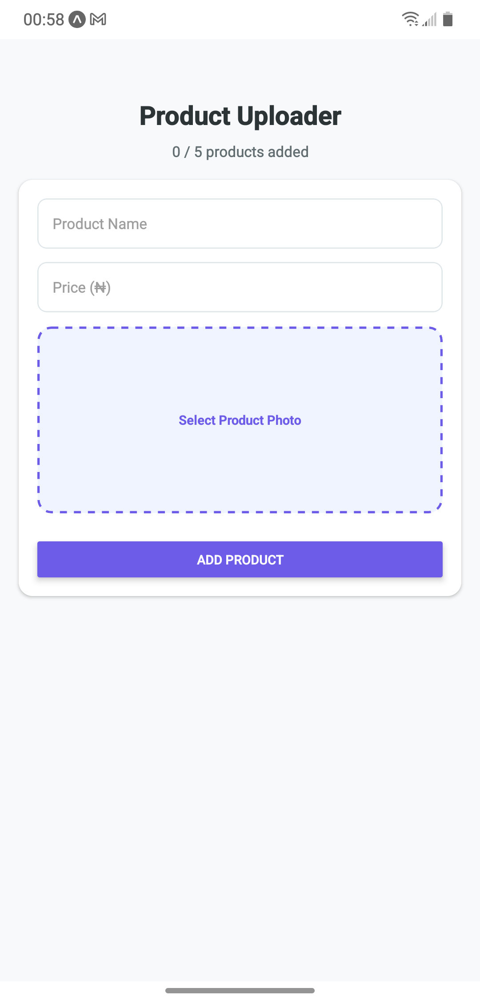
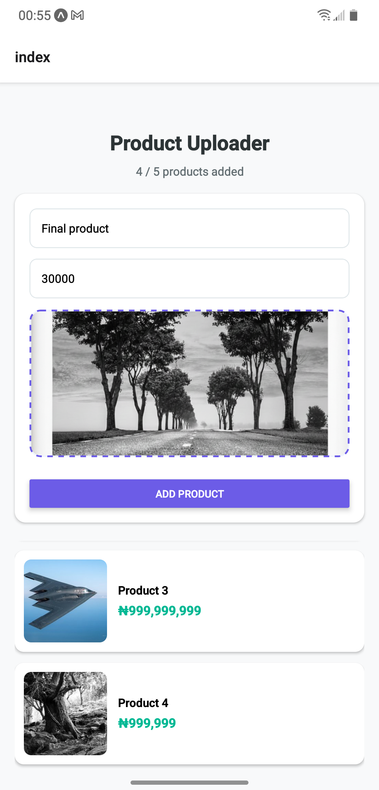
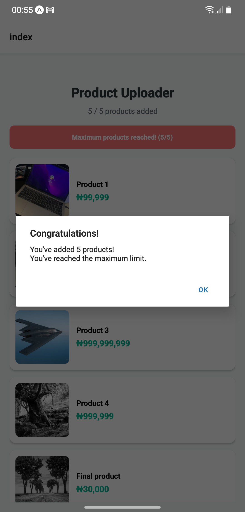

# Product Uploader – React Native App

A simple, clean React Native mobile application that allows users to upload up to **5 products**, each containing a name, photo, and price. Once the limit is reached, users are clearly notified and the input form is disabled.

Perfect as a starter project, demo, or learning example for React Native beginners/intermediate developers.

## Features

- Add products with:
  - Product name
  - Price (with proper number formatting)
  - Photo (picked from device gallery)
- Maximum limit of **5 products**
- Real-time counter (X/5)
- Visual feedback when limit is reached (banner + final alert)
- Clean, modern card-based product list
- Input validation & user-friendly error messages
- Smooth image preview in the picker
- Responsive and intuitive UI/UX

## Tech Stack

- **React Native** (Expo)
- **Local state management** using React Hooks (`useState`)
- **Expo Image Picker** for gallery photo selection
- Pure React Native components + `StyleSheet` for styling
- No external state libraries (Redux/MobX/Context). Kept deliberately simple

> **Note:** While the requirement mentioned using Redux, Context, or similar, this version intentionally uses React's built-in `useState` for maximum simplicity and zero boilerplate — ideal for small apps like this.  
> You can easily extend it with Context or Redux if desired.

## Screenshots

<!-- Example placeholder -->




## Installation

```bash
# 1. Clone the repository
git clone https://github.com/YOUR_USERNAME/product-uploader.git
cd product-uploader

# 2. Install dependencies
npm install
# or
yarn install

# 3. Install Expo CLI globally (if not already installed)
npm install -g expo-cli

# 4. Start the development server
npx expo start
# or
npm start
# or
yarn start
